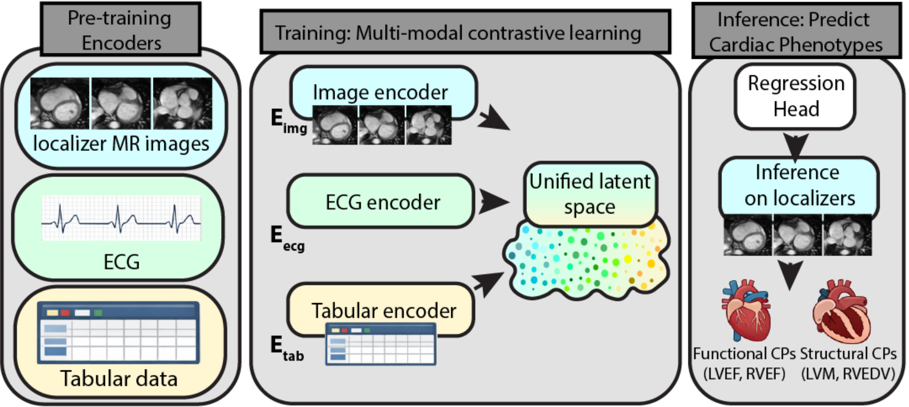

# C-TRIP: Estimating Phenotypes from Localizer MRI through Multi-Modal Representations

[](https://opensource.org/licenses/MIT)
[](https://www.python.org/downloads/)
Official PyTorch implementation of **Opportunistic Cardiac Health Assessment: Estimating Phenotypes from Localizer MRI through Multi-Modal Representations**, accepted at **MICCAI2026**.

C-TRIP (Cardiac Tri-modal Representations for Imaging Phenotypes) is a multimodal contrastive learning framework that aligns Cardiac MRI (Localizer & Cine), Electrocardiograms (ECG), and clinical Tabular phenotypes into a shared latent space and predicts CPs using localizer images as an opportunistic alternative to CMR. 

 

##  Installation

**1. Clone the repository**
```bash
git clone [https://github.com/basrazey/C-TRIP](https://github.com/basrazey/C-TRIP)
cd C-TRIP